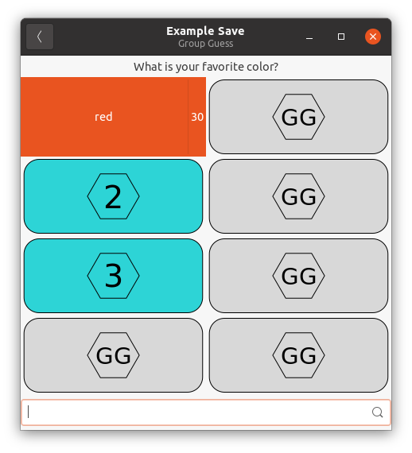

# group-guess
Group Guess, a Family Feud-like game

This is an attempt to build a game like Family Feud, playable digitally in a manner similar to the Jeopardy games available online. This is still very much a work in progress, with a lot of To-Dos (most importantly, testing).

# How to use #

Use the `gg-samesave` script and pass it a Group Guess savefile as an option. An example savefile is in `group_guess/example.json`. It shows the pattern of how a savefile works. As an example, running the example savefile when in the source directory would be `./gg-gamesave group_guess/example.json`.

*When Group Guess is installed with a package, items that you might need (such as the example savefile) are stored in different locations. For more information about where items may be found for the .deb package, see `/usr/share/doc/group-guess/README.Debian`.*

The savefile format is now documented in [SAVE-FORMAT.md](SAVE-FORMAT.md), which helps explain the purpose of everything in a savefile.

# Layout Explanation and Setup #

## Installing from source ##
To install from source (without generating packages), you can use `sudo python3 setup.py install` to install systemwide, or `python3 setup.py install --user` to install userwide with a directory hierarchy within `~/.local`. If installed per-user, you can run a savefile with `~/.local/bin/gg-gamesave /path/to/a/savefile` (with "/path/to/a/savefile" replaced with your savefile).

However, I recommend that you use the package from a release, if available, for the sake of installing systemwide. It still hasn't been tested much.

## group_guess/ directory ##
The `group_guess/` directory contains the library code. Within, it contains `__init__.py`, which is the bulk of the module, `example.py`, which is an example of making a Group Guess game by subclassing, `example.json`, which demonstrates the savefile format as an example savefile (it's a JSON file with specified properties), and the subdirectory `assets/`, which contains the icons used in the game.

## debian/ directory ##
The `debian/` directory contains the files that configure Debian/Ubuntu packaging (a.k.a. can generate .deb packages). The ones that someone would care about are *debian/control* (Notes the dependencies and other package information shown by `apt show`), *debian/changelog* (A changelog, also declares release of new versions, see [deb-changelog(5)](https://manpages.debian.org/bullseye/dpkg-dev/deb-changelog.5.en.html)), and *debian/README.Debian* (which carries notes about the package specific to .deb packaging).

## rpm-group-guess.spec and PKGBUILD ##
While not directories, they are important. PKGBUILD is the build script for making a native package on Arch systems. rpm-group-guess.spec can be used to build a package for RPM systems (only tested on Fedora). The rpm-group-guess.spec file *might* work on other systems, but that is not guaranteed. If you have fixes that make it work on other RPM distros, feel free to submit them.

## For old versions ##
The `group_guess.py` file is a library that can be used to create games of Group Guess, which is similar to Family Feud. The `example.py` file is an example of how to use subclasses to create games. The `gg-gamesave.py` file is code that implements JSON-format gamesave importing. The `example.json` file is `example.py` converted into a JSON savefile, with the difference that debugging is disabled on it. The `assets` directory contains the icons used in the game.

# TODOs #
 - [x] Write the example code. This will show others how to write their own Group Guess game.
 - [ ] Test the code! (The reason why is obvious.)
   - This is partially done. It works, and a single question is answerable. I haven't done more comprehensive testing, though.
 - [x] Write code to support saved games, so that making a new Group Guess game doesn't require making a subclass, but just importing a save file into data structures. This ended up using JSON because it maps well to the internal structure.
 - [ ] Making the app icon.
 - [ ] Support creating proper packages
   - [x] Support creating .deb packages (Debian/Ubuntu packages)
   - [x] Support creating RPM packages
     - Reading the RPM documentation, it seems the ideal way to build with an unpacked tarball is to use `rpmbuild -ba --build-in-place` instead of `rpmbuild -ba` (or `rpmbuild -bs && rpmbuild -bb`).
   - [x] Support creating Arch packages (PKGBUILD)
     - There are icon glitches in the Arch package which I have to debug, but it otherwise works.
 - [ ] Figure out how to make setup.py install documentation, for slight simplification of packaging (and an easier time for self-builders)
 - [ ] Adding more debugging hooks
 - [ ] Use gtk.Application API to support app grouping
 - [ ] Optional: Fancy sound effects.

# Helping Out #
You can help out by adding where stuff is missing, and you can find out about the toolkit I used from the website [The Python GTK+ 3 Tutorial](https://python-gtk-3-tutorial.readthedocs.io/en/latest/). See especially Sections 2 (Getting Started), 3 (Basics), and [5 (Widget Gallery)](https://python-gtk-3-tutorial.readthedocs.io/en/latest/gallery.html). Also relevant: [A list of all GTK+ 3 classes in Python 3 bindings](https://lazka.github.io/pgi-docs/Gtk-3.0/classes.html).
